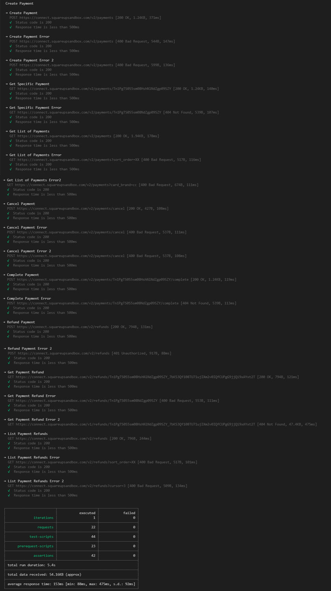

# Postmand + Newman API Testing

## Pre-conditions:
- [Install Node.js](https://nodejs.org/en/download/current/)
- [Install Git](https://git-scm.com/downloads)

## Steps to run the project:
1. Clone the project:

    `git clone https://github.com/PaulinaMontoya/Backend_Challenge.git`

2. Open the project and the terminal to install newman with the next command:

    `npm install --save-dev newman`

3. Run the Postman tests with the next command:

    `newman run` **+** `Drag the <Payment.postman_collection.json> to add the path` **+** `-e` **+** `Drag the <PROD.postman_environment.json> to add the path`

    **i.g.** `newman run` *'c:\Users\username\PC\Documents\Backend_Challenge\API\collection\Create Payment.postman_collection.json'* `-e` *'c:\Users\username\PC\Documents\Backend_Challenge\API\collection\PROD.postman_environment.json'*

4. The expected result is that pass all the tests successfully

    